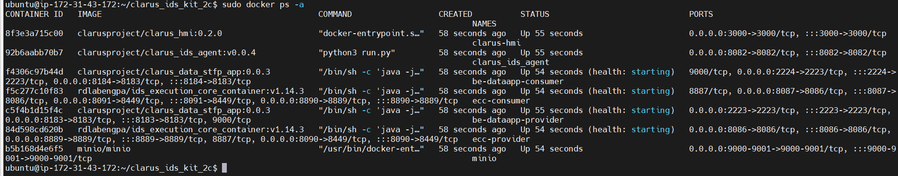

# clarus_ids_kit

This repository contains the docker-compose file and the configuration files and folders needed to deploy (as a provider connector) a TRueConnector using SFTP protocol  and a clarus agent to manage the connector and register clarus assets ( datasets, models, docker compose files).
The repository also contains an additional docker compose file to deploy also a MinIO server that can be used to save the pilots datasets.


## Table of Contents <!-- omit in toc -->


- [clarus\_ids\_kit](#clarus_ids_kit)
  - [Requirements](#requirements)
  - [Components](#components)
  - [Deployment](#deployment)
    - [Clone repository](#clone-repository)
    - [Certificates generation](#certificates-generation)
      - [DAPS certificate generation](#daps-certificate-generation)
      - [TRue Connector certificate generation](#true-connector-certificate-generation)
    - [Configuration](#configuration)
      - [Ecc properties configuration](#ecc-properties-configuration)
      - [Datapp properties configuration](#datapp-properties-configuration)
      - [Environment variables configuration](#environment-variables-configuration)
    - [Start services](#start-services)
  - [How to use to share datasets within Clarus Data Space](#how-to-use-to-share-datasets-within-clarus-data-space)

## Requirements
- Linux machine with public IP with 8 GB RAM and 70 GB Disk 
- Docker version 23.0.5 or above installed
- Docker-compose version 1.29.2 or above installed
- Open ports: 8086, 2223 & 8082
## Components
Next figure shows the components that are part of the clarus_ids_kit.


A brief description of the clarus_ids_kit components:

- TRueConnector A complete description of TrueConnector can be found [here](https://github.com/Engineering-Research-and-Development/true-connector)

- clarus_ids_agent: service that provides diferent endpoints to make easier the management of TRueConnector. It is also in charge of moving datasets from MinIO to dataapp datalake.

- clarus-hmi: Frontend that consumes clarus_ids_agent endpoints. It allows the user to register, delete and view the metamodel for shared datasets within the Clarus Data Space.

- MinIO server: Optional component that can be used by pilot to save their datasets instead of using its own.
  
## Deployment 
The content needed for the deployment is available in the Clarus github repository https://github.com/CLARUS-Project and the images used are in the Clarus docker hub repository https://hub.docker.com/repositories/clarusproject.
The credentials to pull images from docker hub  are saved in the Polimi repository.
### Clone repository
- Clone clarus_ids_kit
    ```
    ./git clone https://github.com/CLARUS-Project/clarus_ids_kit.git
    ``` 
Once repository is cloned you should see next folder tree


- be-dataapp_data_consumer: Not used currently
- be-dataapp_data_provider: Folder used as datalake by the SFTP server started by the dataapp TRueConnector component.
- be-dataapp_resources: Folder where the properties files used by the dataapp are located
- ecc_cert: Folder to save the certificates keystore and truststore
- ecc_reources_provider: Folder where the properties files used by the ecc are located
- images: Not relevant. Images for the Readme file
- uc-dataapp_pip_resources_provider: Folder where the properties files used by the uc-dataapp-pip-provider are located. Currently, usage control components are not used. 
- uc-dataapp_resources_provider: Folder where the properties files used by the uc-dataapp-provider are located. Currently, usage control components are not used.
- .env: Enviromental: variables needed to configure all the components
- docker-compose.yml: File to start all the services. By default, it contains same services as docker-compose-basic.yml
- docker-compose-basic.yml: File with the basic services. (ecc-provider,uc-dataapp-provider,be-dataapp-provideruc-dataapp-pip-provider,clarus_ids_agent)
- docker-compose-minio.yml: MinIO server is added to the basic services
- prepopulate_be_dataapp_data_provider.sh: Not used currently
- renew_daps_certificate.sh: script to renew the Daps certificate when it expires.
- ClarusIdsAgent.postman_collection: Collection that can be imported in Postman tool to make easier the registration of clarus assets. These requests will be used by the clarus-hmi.
- TRUE Connector v1.postman_collection: Collection that can be imported in Postman tool to manage directly the TRueConnector. Not needed if you use the ClarusIdsAgent.postman_collection.

  
**Make sure permissions for folder ecc_cer & be-dataapp_data_provider are set to 777**
### Certificates generation

All the certificates used by the TRue Connector are stored in the keystore ssl-server.jks and in the truststore truststore.jks located in the folder ecc_cert. 
The connector uses the identity provider (DAPS) deployed in the Clarus Data Space. A certificate is needed to authenticate within this Identity Provider.
The connector also needs another certificate to be able to share data with the connector deployed in the MLOps platform and registered also in the Clarus Data Space. 
#### DAPS certificate generation
 The following steps and examples describe the sequence of operations. The names in italics and bold are only as examples.
1.	Create certificate for sharing with DAPS

    openssl req -x509 -nodes -newkey rsa:2048 -keyout ***xx-daps-edge***.key -out ***xx-daps-edge***.cert -sha256 -days 365 -subj "/C=***ES***/ST=***Spain***/L=***GI***/O=***IKERLAN***/OU=***IPD***/CN=***xx-daps-edge-cn***” -addtext "subjectAltName = DNS:***your public DNS or IP***" 
    
2.	Send ***xx-daps-edge***.cert to DAPS operator (luigi.dicorrado@eng.it)

3.	Generate a .p12 using the key/cert pair you created at step 1, (set a password when prompted) and save it at ecc_cert folder
 
    openssl pkcs12 -export -out ***xx-daps-edge***.p12 -inkey ***xx-daps-edge***.key -in ***xx-daps-edge***.cert -name ***preferred_name***
    
4.	Download public certificate (mvds-clarus.eu.crt) from DAPS operator ( http://daps.mvds-clarus.eu ) 

5.	Import certificates to the truststore at ecc_cert

    keytool -import -v -trustcacerts -alias mvds-clarus.eu -file mvds-clarus.eu.crt -keystore truststoreEcc.jks -keypass changeit -storepass allpassword 

    keytool -import -v -trustcacerts -alias ***xx-daps-edge*** -file ***xx-daps-edge***.cert -keystore truststoreEcc.jks -keypass changeit -storepass allpassword 

**DAPS certificate expires every 3 months. In those cases you need to renew the certificate from  daps.mvds-clarus.eu executing the provided script**

- Renew DAPS certificate
  
    ```
    ./renew_daps_certificate.sh
    ```   

#### TRue Connector certificate generation 
The following steps and examples describe the sequence of operations. The names in italics and bold are only as examples.
1.	Create public/private key in keystore

    
    keytool -genkey -alias ***xx-tc-edge*** -keyalg RSA -keypass changeit -storepass changeit -keystore ssl-server.jks -ext SAN=ip:***your public IP***, dns:uc-dataapp-provider,dns:ecc-provider,dns:be-dataapp-provider 
    
2.	Export certificate. 

    
    keytool -export -alias ***xx-tc-edge***  -storepass changeit  -file ***xx-tc-edge***.cer -keystore ssl-server.jks 
    

3.	Import own certificate in truststore

    
    keytool -import -v -trustcacerts -alias ***xx-tc-edge*** -file ***xx-tc-edge***.cer -keystore truststoreEcc.jks -keypass changeit -storepass allpassword 
        

4.	Send exported certificate in step 2 to MLOps platform operator (bkremer@ikerlan.es) and get TRueConnector public certificate from  MLOps cloud platform.

5.	Import in your truststore
    
    keytool -import -v -trustcacerts -alias ***xx-tc-mlops*** -file ***xx-tc-mlops***.cer -keystore truststoreEcc.jks -keypass changeit -storepass allpassword
### Configuration
Several configuration files are needed to adjust the behaviour of the various TrueConnector components.  In addition, an environment variables file eases this configuration.
#### Ecc properties configuration
The ecc configuration files can be found in the ecc_resources_provider folder.  The TRueConnector execution core (ecc) is configured to use the DAPS of the Clarus dataspace (mvds-clarus.eu) as identity provider. The ecc is also configured to use the web sockets protocol as ids protocol. The default values of these files are fine and no modification is required.
#### Datapp properties configuration
The dataapp configuration files can be found in the be-dataapp_resources folder. The default values are fine and only the settings regarding the SFTP server need to be set in the file application-docker.properties.
  - The public IP where the SFTP server is available needs to be set (public IP of the machine where the conector is deployed). 
  
   ```
    #SFTP settings
    application.sftp.host=<<IP Host>>
   ```


#### Environment variables configuration
The .env file contains the enviromental variables needed both for the TRueConnector & clarus agent.
Only the sections regarding with TLS certificates, DAPS certiifcates and agent configuration shall be modified.

- TLS settings. Only the alias for the TrueConnector certificate needs to be set. See [TRue Connector certificate generation](#true-connector-certificate-generation) section
 ````
#TLS settings
KEYSTORE_NAME=ssl-server.jks
KEY_PASSWORD=changeit
KEYSTORE_PASSWORD=changeit
ALIAS=<<ALIAS>>
 ````

- DAPS settings. Name, password and alias for the certificate used to register in DAPS. See [DAPS certificate generation](#daps-certificate-generation) section

````
#DAPS certificate configuration
#When DAPS enabled, set next variables with DAPS certificate. AWS edge machine as an example
PROVIDER_DAPS_KEYSTORE_NAME=<<DAPS CERTIFICATE>>
PROVIDER_DAPS_KEYSTORE_PASSWORD=<<DAPS CERTIFICATE PASSWORD>>
PROVIDER_DAPS_KEYSTORE_ALIAS=<<DAPS CERTIFICATE ALIAS>>

 ````


- Agent settings. The agent needs to know how to reach the TRue Connector. While the agent is deployed in the same docker network as the TrueConnector the TRueConnector agent configuration variables don´t need to be modified. Endpoint, username and password for the MinIO server where datasets are stored have to be set.

````
#TRue Connector agent Configuration
ECC_PROVIDER_IP = ecc-provider  
ECC_PROVIDER_PORT = 8449
PROXY_CONSUMER_IP = be-dataapp-consumer
PROXY_CONSUMER_PORT = 8183
ECC_CONSUMER_IP = ecc-consumer
ECC_CONSUMER_PORT = 8887
ECC_PROVIDER_EXTERNAL_PORT = 8086

#MinIO agent Configuration
MINIO_ENDPOINT = <<MinIO endpont>>
MINIO_USERNAME= <<MinIO username>>
MINIO_PASSWORD = <<MinIO password>>

 ````

### Start services
Move to the folder where the repo has been cloned.
- Login in Dockerhub using the clarusproject credentials provided in the project
    ```
    docker login -username=clarusproject
    ```
There are three compose files in the project: docker-compose-basic.yml, docker-compose-minio.yml and docker-compose.yml. The file docker-compose-basic.yml is the basic version and in this case minio server is not installed. The file docker-compose-minio.yml is the  version that also installs minio server. Be sure that the version you want to deploy is copied in the file docker-compose.yml. By default the file docker-compose.yml contains the basic version.

- Execute docker-compose file
    ```
    docker-compose up -d
    ```

- Once docker-compose is finished, all the services shall be up and running. To check it, write in terminal type in terminal
    ```
    docker ps -a
    ```
You shall see next services up:



## How to use to share datasets within Clarus Data Space

Once the services are up and running clarus-hmi frontend is avilable in port 3000. Use an internet browser and navigate to:

    ```
    http://<<IP where clarus_ids_kit has been deployed>>:3000
    ```

Next screen will be shown:


This screen will show your experiments (datasets) already registered wthin the Clarus DatSpace. 

You can use the REGISTER menu to register a new dataset in the ids connector. Click in the menu and the next screen will appear


- Experiment ID: Unique identifier for the experiment(dataset).It should be the same as the one used as experimentID in the dag configuration.
- Description: Description for the dataset. 
- Type: Choose dataset from the combobox
- MinioEndpoint: IP and port of the MiniIO server where the datasets are saved (<<IP>>:<<port>>)
- Bucket: Bucket where the dataset is saved. (i.e datasets)
- Path: path of the dataset. (i.e usecase01\mydataset.csv)

When click in an ids resource, it is posible to stop sharing the dataset through ids just by clicking on the DELETE button
